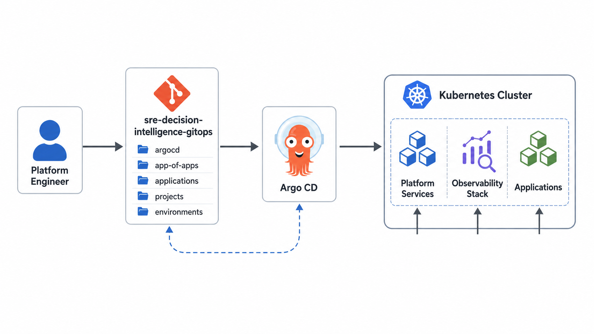
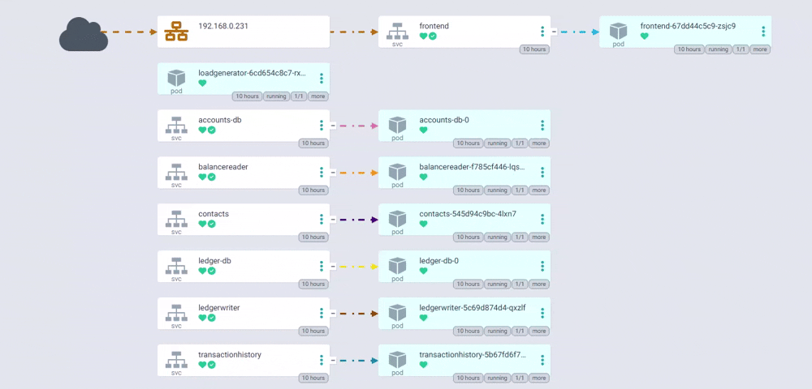

# SRE Decision Intelligence GitOps




This repository contains the GitOps configuration for the SRE Decision Intelligence Platform.

The goal of this project is to build a Kubernetes-based SRE platform that correlates workload and platform signals into actionable incident decisions.

## What this repository manages

This GitOps repository defines the desired state for:

- Argo CD applications
- Bank of Anthos workload deployment
- Prometheus metrics and SLO rules
- Fluent Bit log collection
- OpenSearch log storage and search
- Grafana dashboards
- Decision Intelligence application deployment
- Platform documentation and runbooks

## Deployment target

The platform is designed for a Talos Kubernetes cluster.

## Signal model

The platform collects two categories of signals:

| Signal domain | Purpose |
|---|---|
| Workload signals | Detect user and business impact |
| Platform signals | Explain runtime, infrastructure, rollout, network, and storage context |

## High-level flow

```text
Bank of Anthos + Kubernetes Platform
        ↓
Prometheus + Fluent Bit + OpenSearch + Kubernetes API + Argo CD
        ↓
Decision Intelligence API
        ↓
Impact → Evidence → Root Cause → Safe Action
```