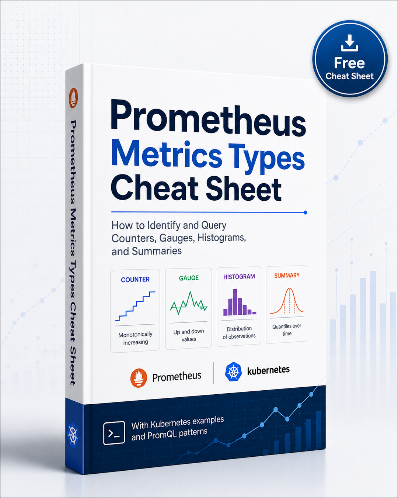

# Prometheus Metrics Types Cheat Sheet



A practical cheat sheet for identifying Prometheus metric types and choosing the correct PromQL query style, especially for Kubernetes, kube-state-metrics, cAdvisor, and application metrics.

---

## 1. Metric Discovery Query

This query lists all metric names available for a namespace and counts how many time series each metric has:

```promql
count by (__name__) (
  {namespace="fintech-workload"}
)
```

### What it means

This query answers:

> Which metric names exist for `namespace="fintech-workload"`, and how many series does each metric have?

It does **not** directly tell you whether a metric is a counter, gauge, histogram, or summary. But it is very useful for discovering which metrics are available before building dashboards or alerts.

---

# Core Prometheus Metric Types

Prometheus has four main metric types:

| Metric type | Meaning | Common query style |
|---|---|---|
| Counter | A value that only increases, except when reset | `rate()` / `increase()` |
| Gauge | A value that can go up and down | Use directly / aggregate |
| Histogram | Bucketed distribution of observations | `histogram_quantile()` |
| Summary | Precomputed quantiles or sum/count pairs | Use quantile label or sum/count average |

---

# 1. Counter

A **counter** is a metric that only goes up over time, unless the process restarts and the value resets to zero.

## How it behaves

```text
0 → 1 → 2 → 3 → 10 → 25
```

A counter represents accumulated events or accumulated resource usage.

## Common name patterns

```text
*_total
*_count
*_sum
*_seconds_total
*_bytes_total
```

## Common examples

```promql
http_requests_total
container_cpu_usage_seconds_total
container_network_receive_bytes_total
container_network_transmit_bytes_total
kube_pod_container_status_restarts_total
```

## How to query counters

Use `rate()` when you want a per-second rate:

```promql
rate(http_requests_total[5m])
```

Use `increase()` when you want the total increase over a time window:

```promql
increase(http_requests_total[15m])
```

## Counter example: container restarts

```promql
sum by (pod, container) (
  increase(kube_pod_container_status_restarts_total{namespace="fintech-workload"}[15m])
)
```

### Meaning

> How many container restarts happened in the last 15 minutes?

## Counter example: CPU usage

```promql
sum by (pod) (
  rate(container_cpu_usage_seconds_total{namespace="fintech-workload", container!="POD"}[5m])
)
```

### Meaning

> How many CPU cores each pod is currently consuming.

Example interpretation:

```text
0.5 = half a CPU core
1.0 = one full CPU core
2.0 = two CPU cores
```

Even though this metric is about CPU usage, it is still a **counter** because it stores accumulated CPU seconds.

---

# 2. Gauge

A **gauge** is a metric that can go up and down.

It represents the current state of something.

## How it behaves

```text
70 → 75 → 62 → 81 → 40
```

## Common name patterns

```text
*_usage
*_bytes
*_memory
*_temperature
*_replicas
*_available
*_ready
*_status
*_limit
*_request
```

## Common examples

```promql
container_memory_working_set_bytes
kube_deployment_status_replicas_available
kube_deployment_spec_replicas
kube_pod_status_ready
node_memory_MemAvailable_bytes
kube_pod_container_resource_requests
kube_pod_container_resource_limits
```

## How to query gauges

Use the metric directly:

```promql
container_memory_working_set_bytes{namespace="fintech-workload"}
```

Or aggregate it:

```promql
sum by (pod) (
  container_memory_working_set_bytes{namespace="fintech-workload", container!="POD"}
)
```

## Gauge example: pod memory usage

```promql
sum by (pod) (
  container_memory_working_set_bytes{namespace="fintech-workload", container!="POD"}
)
```

### Meaning

> Current memory usage per pod.

## Gauge example: deployment available replicas

```promql
kube_deployment_status_replicas_available{namespace="fintech-workload"}
```

### Meaning

> Current number of available replicas per deployment.

## Gauge example: desired replicas

```promql
kube_deployment_spec_replicas{namespace="fintech-workload"}
```

### Meaning

> Desired number of replicas configured for each deployment.

## Gauge example: availability gap

```promql
kube_deployment_spec_replicas{namespace="fintech-workload"}
-
kube_deployment_status_replicas_available{namespace="fintech-workload"}
```

### Meaning

> Desired replicas minus available replicas.

If the result is greater than `0`, the deployment is missing replicas.

---

# 3. Histogram

A **histogram** measures distributions using buckets.

Histograms are commonly used for:

- Request latency
- Request size
- Response size
- Queue duration
- Processing duration

## Common metric parts

Histograms usually expose multiple related metrics:

```text
*_bucket
*_sum
*_count
```

## Common examples

```promql
http_request_duration_seconds_bucket
http_request_duration_seconds_sum
http_request_duration_seconds_count
apiserver_request_duration_seconds_bucket
```

## How to identify histograms

If you see a metric ending with:

```text
_bucket
```

it is usually a histogram.

Histograms also usually have an `le` label.

Example:

```text
le="0.1"
le="0.5"
le="1"
le="2.5"
le="+Inf"
```

`le` means **less than or equal to**.

## How to query histograms

Use `histogram_quantile()`.

## Histogram example: p95 latency

```promql
histogram_quantile(
  0.95,
  sum by (le) (
    rate(http_request_duration_seconds_bucket{namespace="fintech-workload"}[5m])
  )
)
```

### Meaning

> 95% of requests are faster than this value.

## Histogram example: p95 latency per pod

```promql
histogram_quantile(
  0.95,
  sum by (le, pod) (
    rate(http_request_duration_seconds_bucket{namespace="fintech-workload"}[5m])
  )
)
```

### Meaning

> p95 request latency per pod.

## Histogram example: p99 latency per route

```promql
histogram_quantile(
  0.99,
  sum by (le, route) (
    rate(http_request_duration_seconds_bucket{namespace="fintech-workload"}[5m])
  )
)
```

### Meaning

> p99 request latency grouped by route.

---

# 4. Summary

A **summary** also measures distributions, but unlike histograms, it can expose precomputed quantiles from the application itself.

## Common metric parts

Summaries often expose:

```text
*_sum
*_count
```

They may also expose a `quantile` label:

```text
quantile="0.5"
quantile="0.9"
quantile="0.95"
quantile="0.99"
```

## Common examples

```promql
go_gc_duration_seconds
rpc_duration_seconds
http_request_duration_seconds
```

## How to identify summaries

Look for metrics with a `quantile` label:

```promql
http_request_duration_seconds{quantile="0.95"}
```

## How to query summaries

Use the quantile metric directly:

```promql
http_request_duration_seconds{quantile="0.95"}
```

Or calculate average duration using `_sum` and `_count`:

```promql
rate(http_request_duration_seconds_sum[5m])
/
rate(http_request_duration_seconds_count[5m])
```

### Meaning

> Average request duration over the last 5 minutes.

---

# Fast Identification Rules

| Metric shape | Likely type | Query function |
|---|---|---|
| Ends with `_total` | Counter | `rate()` / `increase()` |
| Goes only up | Counter | `rate()` / `increase()` |
| Ends with `_seconds_total` | Counter | `rate()` |
| Ends with `_bytes_total` | Counter | `rate()` |
| Goes up and down | Gauge | Direct value |
| Ends with `_bucket` | Histogram | `histogram_quantile()` |
| Has `le` label | Histogram | `histogram_quantile()` |
| Has `quantile` label | Summary | Direct value |
| Ends with `_sum` and `_count` | Histogram or summary component | Usually `rate()` |
| Ends with `_info` | Info metric | Use for labels/metadata |
| Status metric with value `0` or `1` | Gauge | Filter with `== 1` |

---

# Kubernetes Metrics Cheat Sheet

## Pod restarts

Metric:

```promql
kube_pod_container_status_restarts_total
```

Type:

```text
Counter
```

Query:

```promql
sum by (pod, container) (
  increase(kube_pod_container_status_restarts_total{namespace="fintech-workload"}[15m])
)
```

Meaning:

> Number of container restarts in the last 15 minutes.

---

## Current pod memory

Metric:

```promql
container_memory_working_set_bytes
```

Type:

```text
Gauge
```

Query:

```promql
sum by (pod) (
  container_memory_working_set_bytes{namespace="fintech-workload", container!="POD"}
)
```

Meaning:

> Current memory usage per pod.

---

## Current CPU usage

Metric:

```promql
container_cpu_usage_seconds_total
```

Type:

```text
Counter
```

Query:

```promql
sum by (pod) (
  rate(container_cpu_usage_seconds_total{namespace="fintech-workload", container!="POD"}[5m])
)
```

Meaning:

> Current CPU cores used per pod.

---

## CPU usage as percentage of requested CPU

```promql
100 *
sum by (pod) (
  rate(container_cpu_usage_seconds_total{namespace="fintech-workload", container!="POD"}[5m])
)
/
sum by (pod) (
  kube_pod_container_resource_requests{namespace="fintech-workload", resource="cpu"}
)
```

Meaning:

> Pod CPU usage compared to requested CPU.

---

## Memory usage as percentage of requested memory

```promql
100 *
sum by (pod) (
  container_memory_working_set_bytes{namespace="fintech-workload", container!="POD"}
)
/
sum by (pod) (
  kube_pod_container_resource_requests{namespace="fintech-workload", resource="memory"}
)
```

Meaning:

> Pod memory usage compared to requested memory.

---

## Deployment available replicas

Metric:

```promql
kube_deployment_status_replicas_available
```

Type:

```text
Gauge
```

Query:

```promql
kube_deployment_status_replicas_available{namespace="fintech-workload"}
```

Meaning:

> Number of currently available replicas.

---

## Deployment desired replicas

Metric:

```promql
kube_deployment_spec_replicas
```

Type:

```text
Gauge
```

Query:

```promql
kube_deployment_spec_replicas{namespace="fintech-workload"}
```

Meaning:

> Number of desired replicas.

---

## Deployment replica gap

```promql
kube_deployment_spec_replicas{namespace="fintech-workload"}
-
kube_deployment_status_replicas_available{namespace="fintech-workload"}
```

Meaning:

> How many replicas are missing.

---

## Pod phase

Metric:

```promql
kube_pod_status_phase
```

Type:

```text
Gauge
```

Query:

```promql
kube_pod_status_phase{namespace="fintech-workload", phase="Running"} == 1
```

Meaning:

> Pods currently in `Running` phase.

Other useful phases:

```text
Pending
Running
Succeeded
Failed
Unknown
```

---

## Pending pods

```promql
kube_pod_status_phase{namespace="fintech-workload", phase="Pending"} == 1
```

Meaning:

> Pods currently stuck or waiting in Pending phase.

---

## Failed pods

```promql
kube_pod_status_phase{namespace="fintech-workload", phase="Failed"} == 1
```

Meaning:

> Pods currently in Failed phase.

---

## Container waiting reason

Metric:

```promql
kube_pod_container_status_waiting_reason
```

Type:

```text
Gauge
```

Query:

```promql
kube_pod_container_status_waiting_reason{namespace="fintech-workload"} == 1
```

Meaning:

> Containers currently waiting, grouped by reason.

Common reasons:

```text
CrashLoopBackOff
ImagePullBackOff
ErrImagePull
CreateContainerConfigError
CreateContainerError
ContainerCreating
```

---

## CrashLoopBackOff containers

```promql
kube_pod_container_status_waiting_reason{namespace="fintech-workload", reason="CrashLoopBackOff"} == 1
```

Meaning:

> Containers currently in CrashLoopBackOff.

---

## ImagePullBackOff containers

```promql
kube_pod_container_status_waiting_reason{namespace="fintech-workload", reason="ImagePullBackOff"} == 1
```

Meaning:

> Containers currently failing to pull images.

---

## Network receive rate

Metric:

```promql
container_network_receive_bytes_total
```

Type:

```text
Counter
```

Query:

```promql
sum by (pod) (
  rate(container_network_receive_bytes_total{namespace="fintech-workload"}[5m])
)
```

Meaning:

> Network bytes received per second per pod.

---

## Network transmit rate

Metric:

```promql
container_network_transmit_bytes_total
```

Type:

```text
Counter
```

Query:

```promql
sum by (pod) (
  rate(container_network_transmit_bytes_total{namespace="fintech-workload"}[5m])
)
```

Meaning:

> Network bytes transmitted per second per pod.

---

## Filesystem usage

Metric:

```promql
container_fs_usage_bytes
```

Type:

```text
Gauge
```

Query:

```promql
sum by (pod) (
  container_fs_usage_bytes{namespace="fintech-workload", container!="POD"}
)
```

Meaning:

> Current filesystem usage per pod/container.

---

# Practical Kubernetes Metric Table

| Goal | Metric | Type | Query style |
|---|---|---|---|
| Pod restarts | `kube_pod_container_status_restarts_total` | Counter | `increase(...[15m])` |
| CPU usage | `container_cpu_usage_seconds_total` | Counter | `rate(...[5m])` |
| Memory usage | `container_memory_working_set_bytes` | Gauge | Direct / `sum` |
| Filesystem usage | `container_fs_usage_bytes` | Gauge | Direct / `sum` |
| Network receive | `container_network_receive_bytes_total` | Counter | `rate()` |
| Network transmit | `container_network_transmit_bytes_total` | Counter | `rate()` |
| Deployment desired replicas | `kube_deployment_spec_replicas` | Gauge | Direct |
| Deployment available replicas | `kube_deployment_status_replicas_available` | Gauge | Direct |
| Pod phase | `kube_pod_status_phase` | Gauge | Filter with `== 1` |
| Container waiting reason | `kube_pod_container_status_waiting_reason` | Gauge | Filter with `== 1` |
| HTTP latency buckets | `*_duration_seconds_bucket` | Histogram | `histogram_quantile()` |
| HTTP request total | `*_requests_total` | Counter | `rate()` / `increase()` |
| Error count | `*_errors_total` | Counter | `rate()` / `increase()` |
| Info labels | `*_info` | Info metric | Join/filter metadata |

---

# How To Inspect Metric Type

## Method 1: Prometheus metadata API

Use the Prometheus metadata endpoint:

```bash
curl "http://localhost:9090/api/v1/metadata?metric=kube_pod_container_status_restarts_total"
```

Example output may include:

```json
{
  "type": "counter",
  "help": "The number of container restarts per container."
}
```

---

## Method 2: Prometheus target metadata API

```bash
curl "http://localhost:9090/api/v1/targets/metadata?metric=container_cpu_usage_seconds_total"
```

Example output may include:

```text
type: counter
unit: seconds
help: Cumulative CPU time consumed
```

---

## Method 3: Look at the metric name

This is often the fastest method.

```text
*_total          → usually counter
*_bucket         → histogram bucket
*_bytes          → usually gauge unless ending in _total
*_seconds_total  → counter
*_replicas       → gauge
*_info           → info metric
*_status         → usually gauge
```

---

## Method 4: Graph the raw metric

Run the metric directly:

```promql
kube_pod_container_status_restarts_total{namespace="fintech-workload"}
```

If the line mostly only goes upward, it is likely a **counter**.

Run:

```promql
container_memory_working_set_bytes{namespace="fintech-workload"}
```

If the line goes up and down, it is likely a **gauge**.

---

# Best Discovery Queries

## List all metric names in a namespace

```promql
count by (__name__) (
  {namespace="fintech-workload"}
)
```

---

## Find restart-related metrics

```promql
count by (__name__) (
  {namespace="fintech-workload", __name__=~".*restart.*"}
)
```

---

## Find CPU-related metrics

```promql
count by (__name__) (
  {namespace="fintech-workload", __name__=~".*cpu.*"}
)
```

---

## Find memory-related metrics

```promql
count by (__name__) (
  {namespace="fintech-workload", __name__=~".*memory.*"}
)
```

---

## Find latency histogram metrics

```promql
count by (__name__) (
  {namespace="fintech-workload", __name__=~".*_bucket"}
)
```

---

## Find network counter metrics

```promql
count by (__name__) (
  {namespace="fintech-workload", __name__=~".*network.*total"}
)
```

---

## Find HTTP metrics

```promql
count by (__name__) (
  {namespace="fintech-workload", __name__=~".*http.*"}
)
```

---

## Find error metrics

```promql
count by (__name__) (
  {namespace="fintech-workload", __name__=~".*error.*|.*fail.*"}
)
```

---

## Find kube-state-metrics workload metrics

```promql
count by (__name__) (
  {namespace="fintech-workload", __name__=~"kube_.*"}
)
```

---

## Find cAdvisor container metrics

```promql
count by (__name__) (
  {namespace="fintech-workload", __name__=~"container_.*"}
)
```

---

# Query Function Decision Tree

## If the metric is a counter

Use `rate()` for speed:

```promql
rate(metric_name[5m])
```

Use `increase()` for count over a window:

```promql
increase(metric_name[15m])
```

Examples:

```promql
rate(http_requests_total[5m])
increase(kube_pod_container_status_restarts_total[15m])
```

---

## If the metric is a gauge

Use directly:

```promql
metric_name
```

Or aggregate:

```promql
sum by (pod) (metric_name)
avg by (node) (metric_name)
max by (namespace) (metric_name)
```

Examples:

```promql
sum by (pod) (
  container_memory_working_set_bytes{namespace="fintech-workload", container!="POD"}
)
```

---

## If the metric is a histogram

Use `histogram_quantile()`:

```promql
histogram_quantile(
  0.95,
  sum by (le) (
    rate(metric_bucket[5m])
  )
)
```

For grouping:

```promql
histogram_quantile(
  0.95,
  sum by (le, pod) (
    rate(metric_bucket[5m])
  )
)
```

---

## If the metric is a summary

Use quantile directly:

```promql
metric_name{quantile="0.95"}
```

Or calculate average:

```promql
rate(metric_name_sum[5m])
/
rate(metric_name_count[5m])
```

---

# Common Dashboard Panels For `fintech-workload`

## 1. Restart spike by pod/container

```promql
sum by (pod, container) (
  increase(kube_pod_container_status_restarts_total{namespace="fintech-workload"}[15m])
)
```

Recommended panel type:

```text
Bar gauge / Table / Time series
```

---

## 2. CPU usage by pod

```promql
sum by (pod) (
  rate(container_cpu_usage_seconds_total{namespace="fintech-workload", container!="POD"}[5m])
)
```

Recommended panel type:

```text
Time series / Bar gauge
```

---

## 3. Memory usage by pod

```promql
sum by (pod) (
  container_memory_working_set_bytes{namespace="fintech-workload", container!="POD"}
)
```

Recommended panel type:

```text
Bar gauge / Time series
```

---

## 4. Available replicas by deployment

```promql
kube_deployment_status_replicas_available{namespace="fintech-workload"}
```

Recommended panel type:

```text
Stat / Table / Bar gauge
```

---

## 5. Missing replicas

```promql
kube_deployment_spec_replicas{namespace="fintech-workload"}
-
kube_deployment_status_replicas_available{namespace="fintech-workload"}
```

Recommended panel type:

```text
Stat / Table
```

---

## 6. Pods by phase

```promql
sum by (phase) (
  kube_pod_status_phase{namespace="fintech-workload"} == 1
)
```

Recommended panel type:

```text
Pie chart / Bar chart / Stat
```

---

## 7. Waiting containers by reason

```promql
sum by (reason) (
  kube_pod_container_status_waiting_reason{namespace="fintech-workload"} == 1
)
```

Recommended panel type:

```text
Bar chart / Table
```

---

## 8. Network receive rate by pod

```promql
sum by (pod) (
  rate(container_network_receive_bytes_total{namespace="fintech-workload"}[5m])
)
```

Recommended panel type:

```text
Time series
```

---

## 9. Network transmit rate by pod

```promql
sum by (pod) (
  rate(container_network_transmit_bytes_total{namespace="fintech-workload"}[5m])
)
```

Recommended panel type:

```text
Time series
```

---

## 10. HTTP request rate

Use your application request counter if available:

```promql
sum by (pod) (
  rate(http_requests_total{namespace="fintech-workload"}[5m])
)
```

Recommended panel type:

```text
Time series / Bar gauge
```

---

## 11. HTTP error rate

Example if your app exposes status code labels:

```promql
sum by (pod, status) (
  rate(http_requests_total{namespace="fintech-workload", status=~"5.."}[5m])
)
```

Recommended panel type:

```text
Time series / Table
```

---

## 12. p95 latency

Use your application histogram bucket if available:

```promql
histogram_quantile(
  0.95,
  sum by (le, pod) (
    rate(http_request_duration_seconds_bucket{namespace="fintech-workload"}[5m])
  )
)
```

Recommended panel type:

```text
Time series / Bar gauge
```

---

# Alert Examples

## Any restart in the last 15 minutes

```promql
sum by (namespace, pod, container) (
  increase(kube_pod_container_status_restarts_total{namespace="fintech-workload"}[15m])
) > 0
```

Meaning:

> Alert when any container restarts at least once in 15 minutes.

---

## Restart spike

```promql
sum by (namespace, pod, container) (
  increase(kube_pod_container_status_restarts_total{namespace="fintech-workload"}[15m])
) >= 3
```

Meaning:

> Alert when a container restarts 3 or more times in 15 minutes.

---

## Missing replicas

```promql
kube_deployment_spec_replicas{namespace="fintech-workload"}
-
kube_deployment_status_replicas_available{namespace="fintech-workload"}
> 0
```

Meaning:

> Alert when a deployment has fewer available replicas than desired.

---

## CrashLoopBackOff detected

```promql
sum by (namespace, pod, container, reason) (
  kube_pod_container_status_waiting_reason{namespace="fintech-workload", reason="CrashLoopBackOff"} == 1
) > 0
```

Meaning:

> Alert when a container is in CrashLoopBackOff.

---

## ImagePullBackOff detected

```promql
sum by (namespace, pod, container, reason) (
  kube_pod_container_status_waiting_reason{namespace="fintech-workload", reason="ImagePullBackOff"} == 1
) > 0
```

Meaning:

> Alert when a container cannot pull its image.

---

## High memory usage compared to limit

```promql
100 *
sum by (pod) (
  container_memory_working_set_bytes{namespace="fintech-workload", container!="POD"}
)
/
sum by (pod) (
  kube_pod_container_resource_limits{namespace="fintech-workload", resource="memory"}
)
> 85
```

Meaning:

> Alert when pod memory usage is above 85% of memory limit.

---

## High CPU usage compared to limit

```promql
100 *
sum by (pod) (
  rate(container_cpu_usage_seconds_total{namespace="fintech-workload", container!="POD"}[5m])
)
/
sum by (pod) (
  kube_pod_container_resource_limits{namespace="fintech-workload", resource="cpu"}
)
> 85
```

Meaning:

> Alert when pod CPU usage is above 85% of CPU limit.

---

# Mental Model

Use this simple rule:

```text
Counter   = event count or accumulated usage over time
Gauge     = current state now
Histogram = distribution using buckets
Summary   = precomputed quantiles or sum/count observations
```

For dashboards:

```text
Counter   → rate() or increase()
Gauge     → direct value
Histogram → histogram_quantile()
Summary   → quantile label or sum/count average
```

For Kubernetes dashboards:

```text
CPU       → counter   → rate()
Memory    → gauge     → direct
Restarts  → counter   → increase()
Replicas  → gauge     → direct
Latency   → histogram → histogram_quantile()
Errors    → counter   → rate() or increase()
Network   → counter   → rate()
Status    → gauge     → direct or == 1
```

---

# Common Mistakes

## Mistake 1: Using counters directly

Bad:

```promql
http_requests_total
```

This shows the accumulated total since startup, not the current request rate.

Better:

```promql
rate(http_requests_total[5m])
```

---

## Mistake 2: Using `rate()` on gauges

Bad:

```promql
rate(container_memory_working_set_bytes[5m])
```

Memory is a gauge, so `rate()` is usually not correct.

Better:

```promql
container_memory_working_set_bytes
```

Or:

```promql
sum by (pod) (
  container_memory_working_set_bytes{namespace="fintech-workload", container!="POD"}
)
```

---

## Mistake 3: Treating CPU like a gauge

Bad assumption:

```text
container_cpu_usage_seconds_total is current CPU usage
```

Correct understanding:

```text
container_cpu_usage_seconds_total is accumulated CPU seconds, so it is a counter.
```

Correct query:

```promql
rate(container_cpu_usage_seconds_total[5m])
```

---

## Mistake 4: Forgetting `le` in histogram grouping

Bad:

```promql
histogram_quantile(
  0.95,
  sum(rate(http_request_duration_seconds_bucket[5m]))
)
```

Better:

```promql
histogram_quantile(
  0.95,
  sum by (le) (
    rate(http_request_duration_seconds_bucket[5m])
  )
)
```

For per-pod latency:

```promql
histogram_quantile(
  0.95,
  sum by (le, pod) (
    rate(http_request_duration_seconds_bucket[5m])
  )
)
```

---

# Quick Reference

| Question | Use |
|---|---|
| How many events happened in the last 15 minutes? | `increase(counter[15m])` |
| How fast is something happening per second? | `rate(counter[5m])` |
| What is the current value? | Gauge directly |
| What is p95 latency? | `histogram_quantile(0.95, rate(bucket[5m]))` |
| What pods are failing now? | kube-state-metrics gauge with `== 1` |
| What changed recently? | Counter with `increase()` |
| What is current memory usage? | Gauge directly |
| What is current CPU usage? | Counter with `rate()` |

---

# Recommended Naming For Grafana Panels

| Panel purpose | Recommended title |
|---|---|
| Restarts in last 15 minutes | `Container Restarts - Last 15m` |
| Restart spikes | `Restart Spike by Pod / Container` |
| CPU usage | `CPU Usage by Pod` |
| Memory usage | `Memory Usage by Pod` |
| Replica health | `Deployment Replica Health` |
| Missing replicas | `Missing Replicas` |
| Pod phases | `Pods by Phase` |
| Waiting reasons | `Container Waiting Reasons` |
| CrashLoopBackOff | `CrashLoopBackOff Containers` |
| ImagePullBackOff | `Image Pull Failures` |
| HTTP request rate | `Request Rate` |
| HTTP error rate | `5xx Error Rate` |
| p95 latency | `p95 Latency` |

---

# Final Practical Rule

When you discover a metric with:

```promql
count by (__name__) (
  {namespace="fintech-workload"}
)
```

Ask these questions:

1. Does the metric end with `_total`?
   - Use `rate()` or `increase()`.

2. Does the metric show current state, memory, replicas, ready status, or phase?
   - Use it directly as a gauge.

3. Does the metric end with `_bucket` and contain an `le` label?
   - Use `histogram_quantile()`.

4. Does the metric contain a `quantile` label?
   - It is probably a summary; use the quantile directly.

5. Is it a Kubernetes status metric with values `0` or `1`?
   - Filter with `== 1` to show the active state.

---

